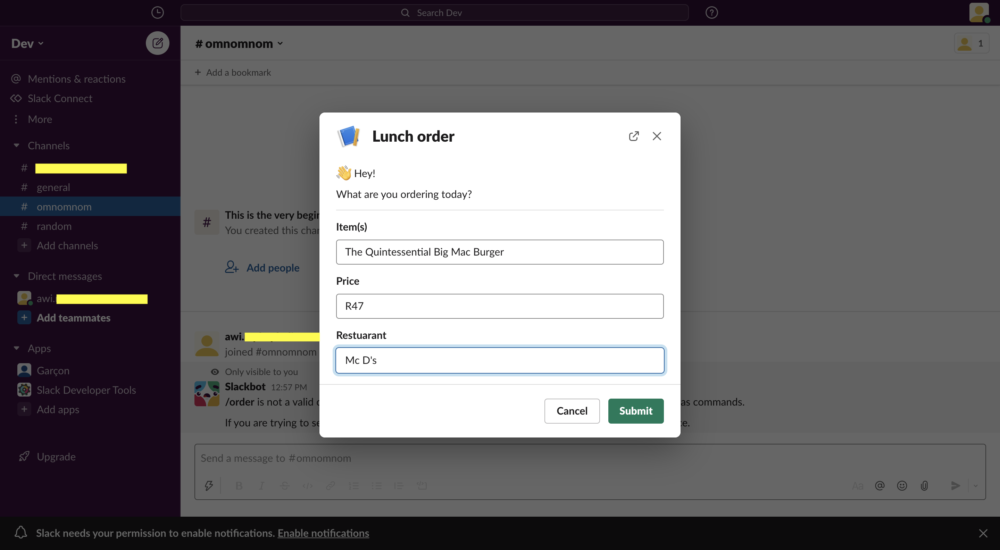

<h1 align="center">Eats :hamburger:</h1>

### :dart: About ###
A Slack bot which takes the food order for the day. As many of us use Slack on a daily basis for work, school, or personal use, we want to use Slack to help us automate the process to track employee food purchases and manage balances instead of manually updating a spreadsheet on a daily basis.

> “Toil is the kind of work that tends to be manual, repetitive, automatable, tactical, devoid of enduring value, and that scales linearly as a service grows.” - [Eric Harvieux: Identifying and tracking toil using SRE principles](https://cloud.google.com/blog/products/management-tools/identifying-and-tracking-toil-using-sre-principles)





Basic steps to set-up a meal allowance; we can break it down into two steps.

- Step 1: Determine how much you want to offer your people and within what timeframe.
  - #### Examples below referenced from [compt.io](https://www.compt.io/meal-allowance-food-stipend-guide#examples)
  - > MasterClass offers their employees $120/month as an interim snack stipend
  - > Snapchat gives its people $16/day for food. 

- Step 2: Decide how the program will be managed.
  - Managing the process manually :weary: :shit:
    -  e.g. Google forms to track submissions or an excel spreadsheet
   - Using [Eats](https://github.com/adoubleyoueye/Eats) :relaxed: :sunglasses:

#### The Flow of Interactions 
1. User clicks *Lunch Order* shortcut.
2. Event listener sends modal view as [json](./assets/lunch_order_view/json) 

```python 
@app.shortcut("create_order")
def open_modal(ack, shortcut, client):
    # Acknowledge the shortcut request
    ack()
    # Call the views_open method using the built-in WebClient
    client.views_open(
        trigger_id=shortcut["trigger_id"],
        # A simple view payload for a modal
        # view=SLACK_ORDER_BLOCK
        view={go to assets folder to see}
```
3. Shortcut triggers a modal as shown [here](#top).
4. User inputs the item, price and restuarant [or a SQL statement :wink:] then hits submit which sends a POST request to our app. 
5. Payload sent back to the server as json
6. The body of that request will contain a interaction payload parameter, 'view_submission' which contains the values we need. The app parses this payload parameter as JSON.
```@app.view("")
def handle_view_events(ack, body, logger):
    ack()
    response_data = body
    team_id = response_data['user']['team_id']
    user_id = response_data['user']['id']
    form_values = response_data['view']['state']['values']
    modal_values = []
    for v in form_values.values():
        modal_values.append(v['plain_text_input-action']['value'])
    # modal_fields = ['item', 'price', 'restaurant']
    # modal_data = zip(modal_fields, modal_values)
    logger.info(modal_data)

    create_order(user_id, team_id,
                 modal_values[0], modal_values[1], modal_values[2])
```  
7. 


## :japanese_castle: Architectural Decisions ##

## :triangular_ruler: Technologies ##

## :white_check_mark: Requirements ##

- The Slack bot will send messages to remind user to drink water periodically
- User can choose when the reminder will be triggered
- Start time (e.g. 9 AM)
- End time (e.g. 5 PM)
- Time interval (e.g. every 2hrs)


## :checkered_flag: Starting ##

```bash
# Clone this project
$ git clone repo

# TBC
...

# The server will initialize on ...
```

## Tests ##

## Deployment checklist ##
- `Run manage.py check --deploy`

## :blue_book: References

- [Codementor](https://www.codementor.io/projects/tool/slack-bot-drink-water-reminder-atx32cnbx1)
- [Slack API documentation](https://api.slack.com/)


## :memo: License ##

This project is under license from MIT. For more details, see the [LICENSE](LICENSE) file.


Made with :heart:

This is an open source project from [DevProjects](http://www.codementor.io/projects). Feedback and questions are welcome!
Find the project requirements here: [Slack bot: drink water reminder](https://www.codementor.io/projects/tool/slack-bot-drink-water-reminder-atx32cnbx1)
